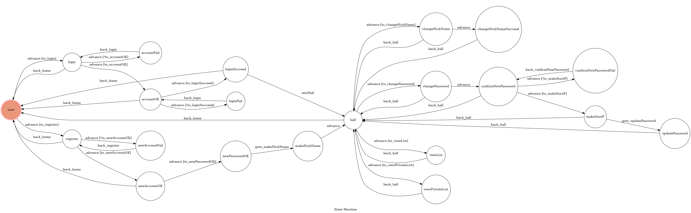

# TOC Project 2019

A Facebook messenger bot based on a finite state machine

## Setup

### Prerequisite
* Python 3
* Facebook Page and App
* HTTPS Server

#### Install Dependency
```sh
pip3 install -r requirements.txt
```

* pygraphviz (For visualizing Finite State Machine)
    * [Setup pygraphviz on Ubuntu](http://www.jianshu.com/p/a3da7ecc5303)

#### Secret Data

`VERIFY_TOKEN` and `ACCESS_TOKEN` **MUST** be set to proper values.
Otherwise, you might not be able to run your code.

#### Run Locally
You can either setup https server or using `ngrok` as a proxy.

**`ngrok` would be used in the following instruction**

```sh
./ngrok http 5000
```

After that, `ngrok` would generate a https URL.

#### Run the sever

```sh
python3 app.py
```

## Finite State Machine


## Usage
The initial state is set to `user`.


* **user**
	* Input : "login"
		* go to state **login** and ask for the account
	* Input : "register"
		* go to state **register** and let user creat a new account

* **login**
	* user input his/her account 
		* `if account exist` : go to state **accountOK**
		* `else` : go to state **accountFail** and reply "wrong account!", 
			       then back to state **login**

* **accountOK**
	* user input his/her password
		* `if password correct` : go to state **loginSucceed** and then go to state **hall**
		* `else` : go to state **loginFail** and reply "wrong password!", 
			       then back to state **accountOK**

* **register**
	* user input his/her new account
		* `if the account already exist` : go to state **newAccountFail** and reply the message, 
			then  back to state **register**
		* `else` : go to state **newAccountOK**

* **newAccountOK**
	* user input his/her new password
		* store the new account and the encoded password into the DB, 
			then go to state **makeNickName**

* **makeNickName**
	* user input his/her nickname with the new account, 
		then go to state **hall**

* **hall**
	* Input : "change nickname"
		* go to state **changNickName** and let user input new nickname
	* Input : "change password"
		* go to state **changePassword** and ask for a new password

* **changNickName**
	* user input his/her new nickname and go to state **changNickNameSucceed**

* **changNickNameSucceed**
	* update the new nickname into DB and back to state **hall**

* **changePassword**
	* user input a new password and go to next state **confirmNewPassword**

* **confirmNewPassword**
	* ask for input new password again 
		* `if the user_input == new password` : go to state **makeSureP**
		* `else` : go to state **confirmNewPasswordFail** and reply "WRONG :(", 
			       then go back state **confirmNewPassword**

* **makeSureP**
	* show buttons to user, and make sure that user wants to change password
		* push "Yes" : go to state **updatePassword**
		* push "No" : back to state **hall**

* **updatePassword**
	* update the new password into DB and back to state **hall**


## Reference
[TOC-Project-2017](https://github.com/Lee-W/TOC-Project-2017) ❤️ [@Mizu](https://github.com/MizuShinku)
